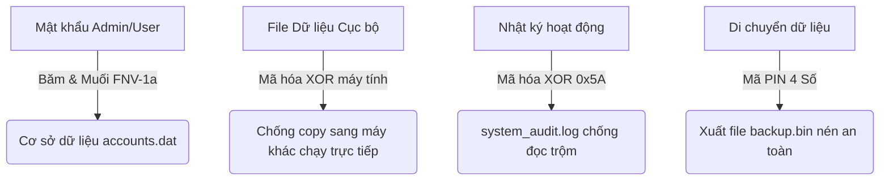

# TÀI LIỆU BẢO MẬT HỆ THỐNG (SECURITY DOCUMENTATION)

Chào mừng bạn đến với tài liệu bảo mật của hệ thống **FCode TrainC Violation Management System**. Tài liệu này được thiết kế để giải thích một cách dễ hiểu, trực quan nhất cho các lập trình viên mới tiếp cận dự án về cách thức hệ thống bảo vệ dữ liệu.

Mặc dù đây là một ứng dụng chạy trên giao diện dòng lệnh (TUI - Terminal User Interface) bằng ngôn ngữ C, hệ thống vẫn được trang bị các lớp bảo mật rất thực tế để ngăn chặn việc sửa đổi điểm số, tiền phạt hoặc thông tin vi phạm trái phép.

---

## 🚀 TỔNG QUAN VỀ CÁC LỚP BẢO VỆ (SECURITY LAYERS)

Hệ thống bảo mật của dự án được xây dựng dựa trên 4 trụ cột chính:

---

## 1. BẢO VỆ MẬT KHẨU TÀI KHOẢN (PASSWORD HASHING & SALTING)

### 📌 Vấn đề:
Nếu lưu mật khẩu dưới dạng văn bản thường (Plaintext), bất kỳ ai mở file cơ sở dữ liệu lên cũng sẽ đọc được mật khẩu của tất cả thành viên.

### 🛠️ Giải pháp của hệ thống:
Hệ thống **không bao giờ lưu mật khẩu thực tế**. Thay vào đó, hệ thống sử dụng cơ chế **Băm (Hashing)** kết hợp **Muối (Salting)**:
1. **Muối ngẫu nhiên (Salt)**: Mỗi khi bạn tạo tài khoản hoặc đổi mật khẩu, hệ thống sinh ra một chuỗi ký tự ngẫu nhiên dài 16 ký tự gọi là "Muối".
2. **Kéo giãn khóa (Key Stretching)**: Hệ thống gộp `Mật khẩu + Muối` lại và thực hiện băm liên tục **1000 vòng** bằng thuật toán FNV-1a để tạo ra một chuỗi băm 64-bit cuối cùng.
3. **Kết quả**: Trong file dữ liệu chỉ lưu chuỗi băm và muối. Khi bạn đăng nhập, hệ thống lấy mật khẩu bạn vừa nhập, trộn với muối đang lưu, băm thử 1000 lần và so sánh kết quả băm. 

> [!NOTE]
> Kể cả khi hacker lấy được file dữ liệu, họ cũng không thể dịch ngược chuỗi băm này thành mật khẩu gốc của bạn.

---

## 2. CHỐNG SAO CHÉP DỮ LIỆU SANG MÁY KHÁC (MACHINE-BINDING)

### 📌 Vấn đề:
Thành viên có thể copy các file cơ sở dữ liệu (`.dat`) từ máy tính của Ban chủ nhiệm về máy cá nhân của mình, sau đó chỉnh sửa trực tiếp dữ liệu tiền phạt hoặc vi phạm để xóa nợ.

### 🛠️ Giải pháp của hệ thống:
* **Khóa XOR động theo máy**: Toàn bộ dữ liệu thành viên (`members.dat`), vi phạm (`violations.dat`) và tài khoản (`accounts.dat`) khi lưu xuống ổ đĩa đều được mã hóa bằng thuật toán XOR đối xứng.
* **Tạo khóa bảo mật**: Khóa XOR này không được lưu trong mã nguồn mà được sinh tự động bằng cách kết hợp **Tên máy tính hiện tại (Computer Name)** và **Đường dẫn thư mục chạy ứng dụng**.
* **Hậu quả**: Nếu sao chép nguyên bản các file `.dat` sang một máy tính khác để chạy, hệ thống tại máy tính mới sẽ sinh ra khóa XOR khác hoàn toàn, dẫn đến việc giải mã thất bại (lỗi Checksum CRC32) và ứng dụng sẽ khóa quyền truy cập dữ liệu ngay lập tức.

---

## 3. BẢO MẬT FILE NHẬT KÝ HỆ THỐNG (ENCRYPTED AUDIT LOG)

### 📌 Vấn đề:
File nhật ký hành trình ghi lại các hoạt động quan trọng như: BCN xóa nợ phạt cho ai, ai bị kích khỏi CLB, ai đổi mật khẩu,... Nếu file nhật ký này để ở dạng text thường (`.txt`/`.log`), thành viên có thể vào xóa bớt dòng log để che giấu hành vi gian lận.

### 🛠️ Giải pháp của hệ thống:
* Hệ thống ghi nhật ký hành động dưới dạng nhị phân mã hóa XOR với khóa tĩnh `0x5A` (giữ lại ký tự xuống dòng `\n`).
* Người ngoài mở file `system_audit.log` bằng Notepad sẽ chỉ thấy các ký tự lạ mắt không đọc được.
* Chỉ BCN khi đăng nhập thành công vào phần mềm mới có quyền gọi chức năng giải mã hiển thị trực quan nhật ký hành động lên màn hình điều khiển.

---

## 4. CHUYỂN GIAO DỮ LIỆU AN TOÀN BẰNG MÃ PIN (BACKUP ARCHIVE)

### 📌 Vấn đề:
Khi Ban chủ nhiệm thực sự cần bàn giao dữ liệu sang máy tính của trưởng ban mới, cơ chế "Chống sao chép dữ liệu" ở mục 2 sẽ chặn không cho chạy. Làm thế nào để bàn giao an toàn?

### 🛠️ Giải pháp của hệ thống:
Chúng tôi cung cấp tính năng **Xuất/Nhập dữ liệu bảo mật**:
1. **Khi Xuất (Export)**:
   * Hệ thống gom 3 file dữ liệu (`accounts.dat`, `members.dat`, `violations.dat`) cùng file nhật ký `system_audit.log` đóng gói thành 1 file duy nhất (ví dụ: `backup.bin`).
   * BCN tự đặt một **mã PIN bảo mật gồm 4 chữ số** (Ví dụ: `1998`). Hệ thống dùng mã PIN này làm chìa khóa để mã hóa file nén đó.
2. **Khi Nhập (Import)**:
   * BCN mang file `backup.bin` sang máy mới và chọn chức năng nhập dữ liệu.
   * Hệ thống yêu cầu nhập đúng mã PIN `1998`. Nếu nhập khớp, hệ thống sẽ tự động giải mã và tự động cấu hình lại cơ sở dữ liệu tương thích hoàn toàn với phần cứng của máy tính mới.

---

## 💡 LỜI KHUYÊN DÀNH CHO LẬP TRÌNH VIÊN MỚI

Khi bạn viết mã nguồn mới hoặc chỉnh sửa dự án này, hãy chú ý:
* **Không lưu trữ mật khẩu plaintext**: Nếu viết chức năng tạo tài khoản mới, bắt buộc phải đi qua hàm băm mật khẩu `hashPassword` trong [src/auth.c](file:///C:/Users/Admin/Desktop/GIT%20CLONE%20edu/fcode-trainc-violation-management-system/src/auth.c).
* **Đảm bảo ghi log**: Mọi hành động làm thay đổi dữ liệu (thêm, sửa, xóa, chuyển tiền) phải gọi hàm `logSystemAction()` ở cuối tiến trình để lưu vết.
* **Bảo toàn cơ chế lưu file**: Luôn sử dụng hàm `fileioSave...` thay vì tự ghi file bằng `fwrite` thông thường để tránh làm hỏng cấu trúc mã hóa XOR và kiểm tra CRC32 mặc định.
